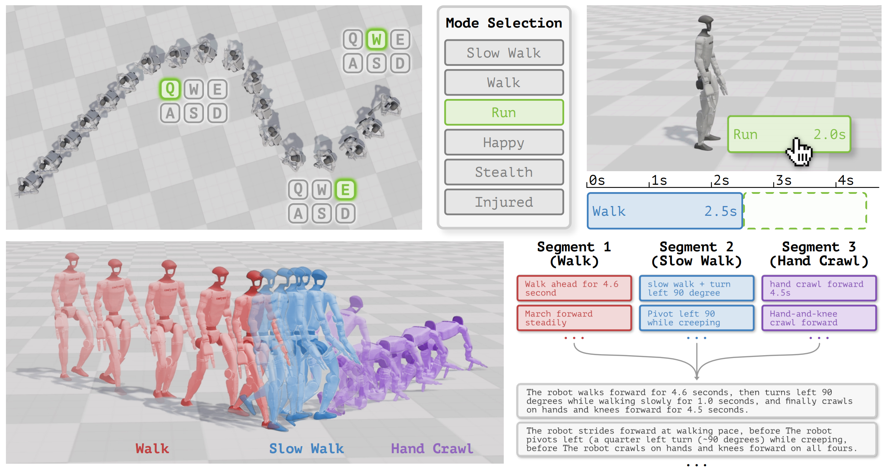
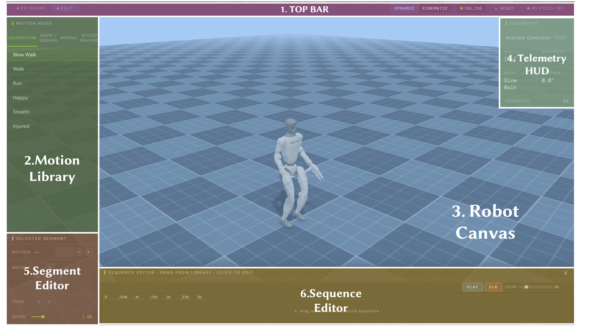
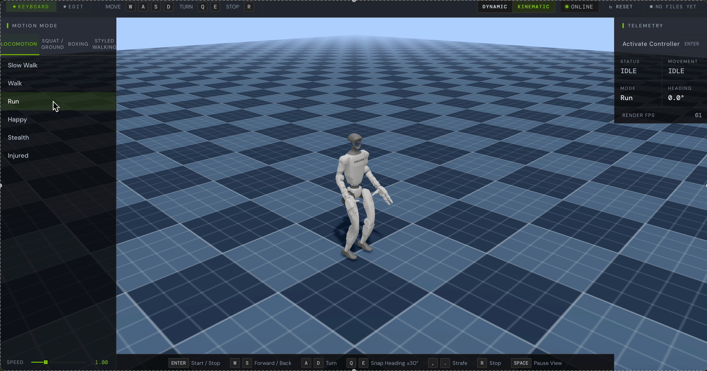
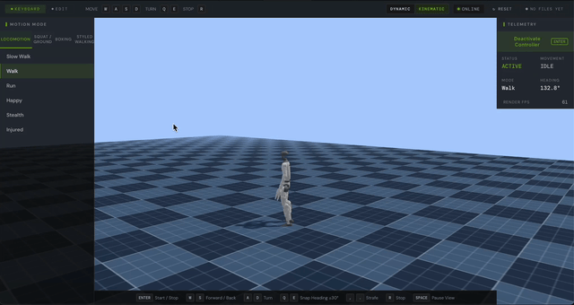
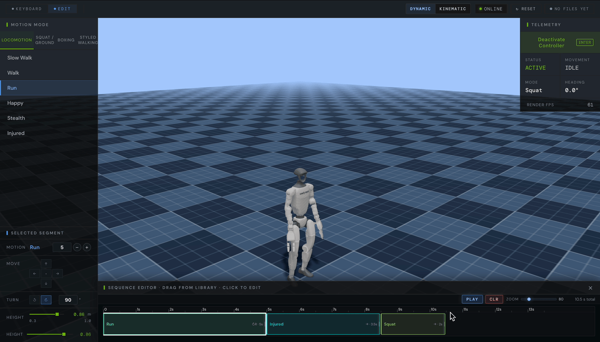
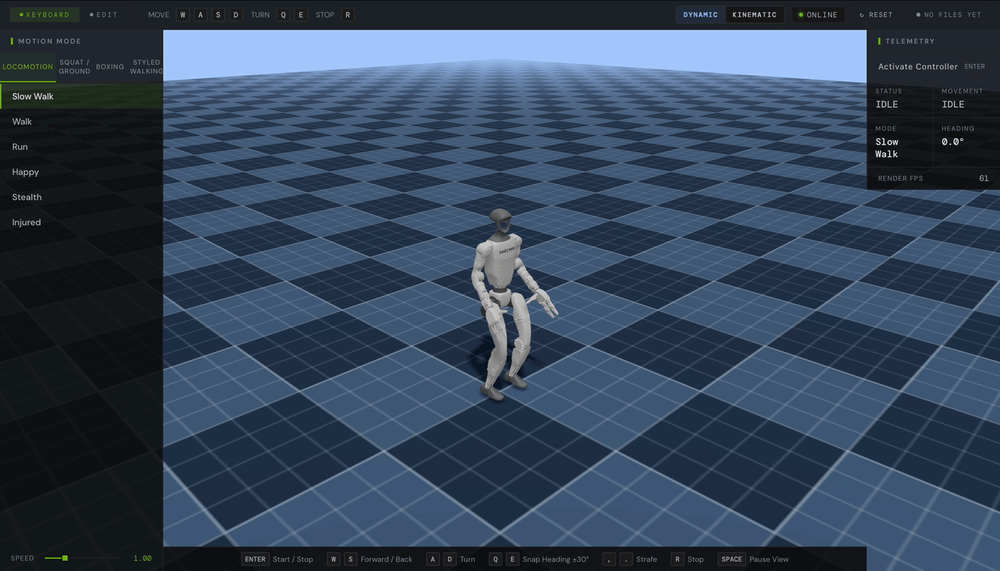

# CLAW🦀: Composable Language-Annotated Whole-body Motion Generation

<p align="center">
  <a href="https://arxiv.org/abs/2604.11251"></a>
  <a href="https://arxiv.org/pdf/2604.11251"></a>
  <a href="https://creativecommons.org/licenses/by/4.0/"></a>
</p>

<p align="center">
  <a href="https://jianuocao.github.io">
  Jianuo Cao</a><sup>*1,2</sup>,
  <a href="https://thomaschen98.github.io">Yuxin Chen</a><sup>*2</sup>,
  <a href="https://me.berkeley.edu/people/masayoshi-tomizuka/">Masayoshi Tomizuka</a><sup>2</sup>
</p>

<p align="center">
  <sup>*</sup>Equal contribution<br>
  <sup>1</sup>Nanjing University &nbsp;&nbsp;
  <sup>2</sup>University of California, Berkeley
</p>

<p align="center">
  
</p>


>
  <strong>CLAW🦀</strong> is a web pipeline for scalable language-annotated whole-body motion generation on Unitree G1.
  Built on <a href="https://nvlabs.github.io/GEAR-SONIC/">SONIC</a>, it composes controllable motion primitives in MuJoCo,
  supports keyboard and timeline editing across 25 motion modes, and exports
  kinematic/dynamic trajectory-language datasets with multi-style annotations.


## Prerequisites

| Requirement | Version |
|---|---|
| Ubuntu | 20.04 / 22.04 / 24.04 (or other Debian-based) |
| Python | ≥ 3.8 |
| Node.js | ≥ 18 |

## Installation

### 1 — Clone this repository

```bash
git clone https://github.com/JianuoCao/GR00T-WBC-Dev
cd GR00T-WBC-Dev
```

### 2 — Set up GR00T-WholeBodyControl

Clone the NVIDIA upstream repo into this directory:

```bash
git clone https://github.com/NVlabs/GR00T-WholeBodyControl.git GR00T-WholeBodyControl
cd GR00T-WholeBodyControl && git lfs pull && cd ..
```

Your directory should now look like:

```
GR00T-WBC-Dev/
├── GR00T-WholeBodyControl/
├── web_wasm_demo/
├── annotation/
└── scripts/
```

Then follow the three official guides to complete the NVIDIA-side setup:

- **[Installation & Build](https://nvlabs.github.io/GR00T-WholeBodyControl/getting_started/installation_deploy.html)** — install dependencies, build the C++ inference stack
- **[Download Models](https://nvlabs.github.io/GR00T-WholeBodyControl/getting_started/download_models.html)** — pull policy checkpoints and ONNX files via `git lfs`
- **[Quick Start](https://nvlabs.github.io/GR00T-WholeBodyControl/getting_started/quickstart.html)** — Following the **"One-time setup"** section (install the MuJoCo sim environment) is enough.

### 3 — Link robot model assets

```bash
ln -sfn ../../GR00T-WholeBodyControl/gear_sonic_deploy/g1 web_wasm_demo/public/g1
ln -sfn ../../GR00T-WholeBodyControl/gear_sonic_deploy/policy web_wasm_demo/public/policy
```

> These expose the G1 model files and policy checkpoints to the Vite dev server, which only serves files under `public/`.

### 4 — Install web demo dependencies

**Python bridge** (WebSocket ↔ ZMQ):

```bash
pip3 install -r web_wasm_demo/requirements.txt
```

**Frontend** (Vite + Three.js + MuJoCo WASM):

```bash
npm install --prefix web_wasm_demo
```

---

## Running the Demo

Open **four terminals**, all from the `GR00T-WBC-Dev/` root.

### Terminal 1 — MuJoCo simulation

```bash
source GR00T-WholeBodyControl/.venv_sim/bin/activate
python GR00T-WholeBodyControl/gear_sonic/scripts/run_sim_loop.py
```

A MuJoCo window will appear. Press **`9`** in that window to start the simulation.

### Terminal 2 — C++ controller

> Do **not** press Enter here until prompted — the script will ask for confirmation before starting real/sim hardware.

1. Check whether `./GR00T-WholeBodyControl/gear_sonic_deploy/build` exists.
2. If it does not exist, complete **[Installation & Build](https://nvlabs.github.io/GR00T-WholeBodyControl/getting_started/installation_deploy.html)** first.
3. Start the controller using one of the following methods.

If you built on the host, run:
```bash
./GR00T-WholeBodyControl/gear_sonic_deploy/deploy.sh sim --input-type zmq_manager
```
If you built in Docker, run:
```bash
./GR00T-WholeBodyControl/gear_sonic_deploy/docker/run-ros2-dev.sh
./deploy.sh sim --input-type zmq_manager
```
4. Wait until Terminal 2 shows `Init Done`, then open Terminal 3.

### Terminal 3 — WebSocket bridge

```bash
python web_wasm_demo/ws_bridge.py
```

### Terminal 4 — Frontend

```bash
npm run dev --prefix web_wasm_demo
```

Open **[http://localhost:5173](http://localhost:5173)** in your browser (5173 is Vite's default port — check the terminal if it differs).

---

## Demo Walkthrough

### Overview



The interface is organized into six primary regions:

1. **Top Bar**: control mode, render mode, the `ONLINE` indicator, `Reset`, and file status.
2. **Motion Library**: the upper half of the left panel for browsing motion categories and motion clips.
3. **Robot Canvas**: the central viewport where the robot is rendered and previewed live.
4. **Telemetry HUD**: the right-side status panel showing controller state, movement, heading, and FPS.
5. **Segment Editor**: the lower half of the left panel, which appears when a segment is selected for editing.
6. **Sequence Editor**: the bottom timeline used to arrange and review motion segments.

> [!TIP]
> When the page first opens, check whether the `ONLINE` indicator in the top-right corner is lit. If it is, the frontend has connected to the backend bridge successfully. Then select both a **control mode** and a **render mode** before continuing with the demo.

#### Control mode

The interface provides two control modes:

- [`Keyboard Mode`](#keyboard-mode): direct real-time control from the keyboard.
- [`Editor Mode`](#editor-mode): timeline-based authoring for multi-segment motion sequences.

#### Render mode

The render mode determines how the motion is visualized:

- **Kinematic**: the robot follows the commanded trajectory directly, which is useful for clean preview, quick inspection, and sequence editing.
- **Dynamic**: the robot is shown under the physics-driven controller, which better reflects physically grounded execution and controller response.

Place the two render-mode demos side by side:

<table>
  <tr>
    <td width="50%">
      <p><strong>Kinematic motion</strong></p>
      
    </td>
    <td width="50%">
      <p><strong>Dynamic motion</strong></p>
      
    </td>
  </tr>
</table>


---

### Keyboard Mode

| Key | Action |
|---|---|
| `Enter` | Activate or deactivate the controller |
| `W` / `S` | Move forward or backward |
| `A` / `D` | Turn left or right |
| `Q` / `E` | Snap heading by `-30°` or `+30°` |
| `,` / `.` | Strafe left or right (not available in some idle modes) |
| `R` | Stop the current movement |
| `Space` | Pause the viewport |

#### User Guide
1. Press `Enter` to activate control.


2. Click to select a motion from the motion library on the left.



3. Use the keyboard to control the robot's direction, actions, speed, and root height.

<table>
  <tr>
    <td width="50%">
      
    </td>
    <td width="50%">
      
    </td>
  </tr>
  <tr>
    <td width="50%">
      
    </td>
    <td width="50%">
      
    </td>
  </tr>
</table>

> [!TIP]
> The planner transitions smoothly between modes by using the current robot state as its starting point, so you can switch to another motion at any time.

---

### Editor Mode


#### Basic Functions

**Drag**: drag a motion from the library into the sequence editor to create a new segment.


**Zoom**: zoom the timeline to inspect segment boundaries and timing more precisely.



**Clear**: clear the current sequence and return to an empty editing state.



#### Segment Editor panel

Once a segment is selected on the timeline, the lower-left panel becomes the `Segment Editor`.

- `Motion`: motion clip assigned to the segment.
- `Move`: directional intent.
- `Turn`: turn behavior or heading change.
- `Speed / Height`: motion-specific parameters (when available).


---

### Play Motion

To play a motion sequence:

1. Drag motions into the timeline and edit them as needed.
2. Press `Enter` to activate control.
3. Click `Play` to start the sequence. The robot will execute it in the canvas, and the timeline will advance from left to right.
4. After playback, the interface automatically loads the kinematic trajectory, dynamic trajectory, and text annotation for the sequence. You can download these outputs directly. See [Output Data Format](#output-data-format) for more details.


---

### Output Data Format

After each sequence playback, the backend produces a structured data package stored under `web_wasm_demo/results/<run_id>/`. Three files are presented for download in the browser:

| File | Description |
|---|---|
| `trajectory_kinematic.csv` | Kinematic reference trajectory at 50 Hz. Columns: timestamp, base pose (`base_x/y/z`, `qw/qx/qy/qz`), and 29 joint positions. Base XY is normalized so the trajectory starts at the origin. |
| `trajectory_dynamic.csv` | Measured (physics-simulated) trajectory at 50 Hz. Same column layout as the kinematic CSV, with absolute base positions. |
| `annotation.json` | Natural-language motion descriptions in a structured JSON format. |

---

## Acknowledgements

This project builds on [GEAR-SONIC / GR00T-WholeBodyControl](https://github.com/NVlabs/GR00T-WholeBodyControl) by NVIDIA GEAR Lab.

